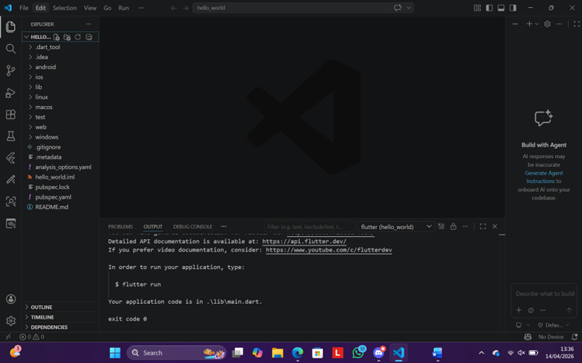
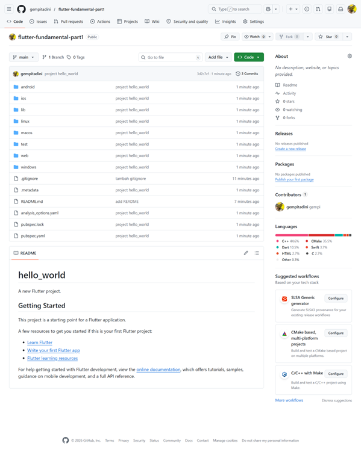
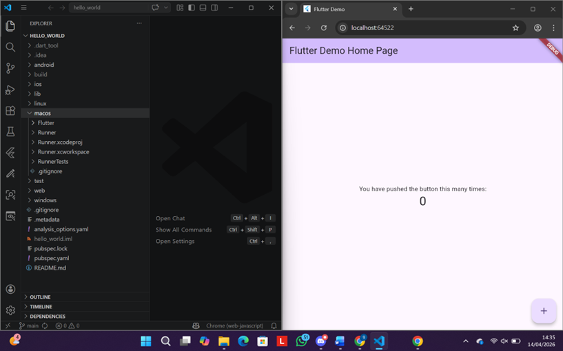
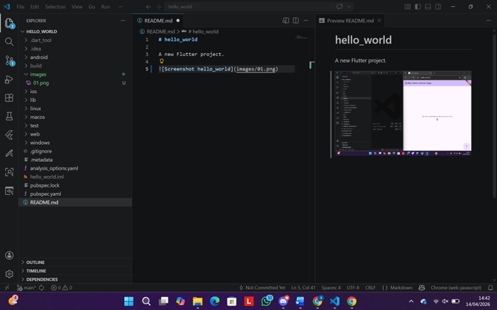
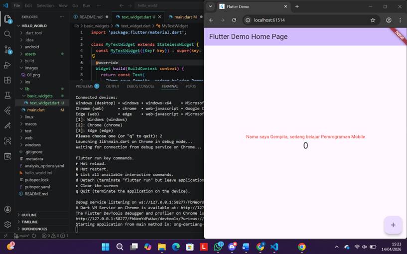
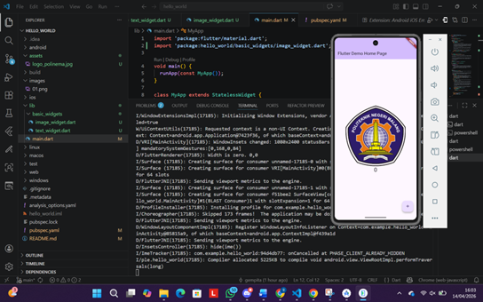
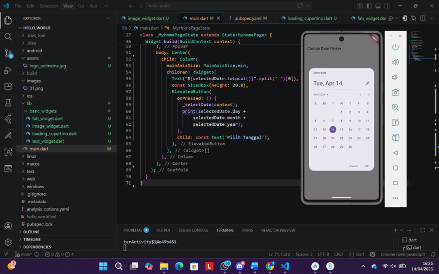

# Laporan Praktikum Flutter - Hello World

**Nama**    : Gempita Fitri Nurdini  
**Kelas**   : SIB 2F  
**Absen**   : 12  
**NIM**     : 244107060083  

---

## Praktikum 1: Membuat Project Flutter Baru
Pada tahap awal ini, saya membuat sebuah project Flutter baru bernama hello_world menggunakan perintah flutter create.

---

## Praktikum 2: Menghubungkan dengan Emulator
Pada praktikum ini, saya mencoba menjalankan aplikasi yang telah dibuat.
Dengan menggunakan perintah flutter run, aplikasi berhasil ditampilkan di browser/device dan menampilkan halaman default dari Flutter sebagai tanda bahwa project berjalan dengan baik.

---

## Praktikum 3: Membuat Repository GitHub dan Laporan Praktikum

Pada tahap ini, saya mulai mengelola project menggunakan GitHub.
Langkah yang dilakukan meliputi pembuatan repository, menghubungkan project lokal ke repository, serta melakukan commit dan push. Selain itu, saya juga mulai menyusun dokumentasi praktikum dalam bentuk file README.md.

---

## Praktikum 4: Menerapkan Widget Dasar

Pada praktikum ini, saya mulai mempelajari komponen dasar dalam Flutter, yaitu widget. Widget digunakan untuk membangun tampilan antarmuka aplikasi.

### Text Widget
Widget Text digunakan untuk menampilkan tulisan pada layar aplikasi.

### Text Image
Widget Image digunakan untuk menampilkan gambar pada layar aplikasi.

---

## Praktikum 5: Menerapkan Widget Material Design dan iOS Cupertino

Pada tahap ini, saya mengeksplorasi berbagai jenis widget yang tersedia di Flutter, baik dari Material Design maupun Cupertino (gaya iOS). Hal ini bertujuan untuk memahami variasi tampilan dan fungsi yang dapat digunakan dalam aplikasi.

Beberapa widget yang dicoba antara lain:
- Tombol dan indikator loading (Cupertino)  
- Floating Action Button (FAB)  
- Dialog  
- Input field  
- Date picker  

